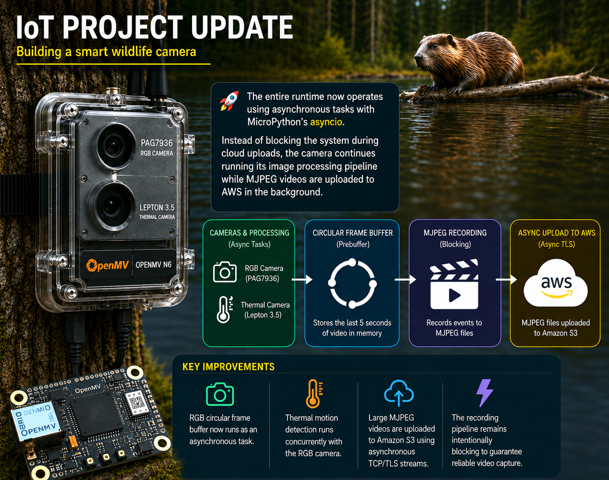

# IoT Wildlife Camera

> A smart dual-camera wildlife monitoring system built with the OpenMV N6 that automatically detects, records, uploads, and identifies wildlife using thermal imaging, computer vision, and AWS cloud services.



---

## Overview

This project is a fully autonomous wildlife camera designed to monitor nature without human intervention.

The system continuously monitors the environment using a FLIR Lepton thermal camera while maintaining a circular RGB frame buffer in memory. When thermal motion is detected, the buffered frames are preserved, the event is recorded as an MJPEG video, and the recording is uploaded to AWS for automatic wildlife recognition.

The embedded software is written entirely in **MicroPython** for the **OpenMV N6**. The runtime has recently been redesigned around **MicroPython's asyncio**, allowing cloud uploads to execute in the background while image processing continues uninterrupted.

---

## Demo

🎥 **Outdoor Test – PAG7936 RGB & FLIR Lepton**

Outdoor test footage demonstrating the PAG7936 RGB camera and FLIR Lepton thermal camera in the OpenMV N6 wildlife camera system.

▶️ [Watch the test video on YouTube](https://www.youtube.com/watch?v=YeA9baXi2Uw)

---

## Features

- 🔥 Thermal motion detection using a FLIR Lepton camera
- 📷 High-quality RGB recording using the PAG7936 camera
- 🧠 5-second circular RGB frame buffer
- 🎥 Automatic MJPEG event recording
- ⚡ Asynchronous runtime powered by MicroPython `asyncio`
- ☁️ Background uploads to Amazon S3
- 🤖 Automatic wildlife recognition using Amazon Rekognition
- 📊 Detection metadata stored in Amazon DynamoDB
- 🌐 Remote configuration support
- 💾 Automatic local storage on microSD

---

## System Architecture

```text
             FLIR Lepton
                   │
                   ▼
        Thermal Motion Detection
                   │
          Motion Detected?
             No │      Yes
                │
                ▼
      RGB Circular Frame Buffer
                │
                ▼
       MJPEG Video Recording
                │
                ▼
  Async Background Upload (S3)
                │
                ▼
            AWS Lambda
                │
                ▼
      Amazon Rekognition
                │
                ▼
       Amazon DynamoDB
```

---

## Hardware

| Component | Description |
|-----------|-------------|
| OpenMV N6 | Main embedded platform |
| PAG7936 | RGB camera |
| FLIR Lepton | Thermal camera |
| microSD | Local video storage |

---

## Software Stack

### Embedded

- MicroPython
- OpenMV Firmware
- MicroPython `asyncio`

### AWS

- Amazon S3
- AWS Lambda
- Amazon Rekognition
- Amazon DynamoDB

---

## How It Works

1. The FLIR Lepton continuously monitors the environment.
2. Thermal motion is detected.
3. A 5-second RGB frame buffer preserves footage from before the trigger.
4. The RGB camera records the event.
5. The recording is stored on the microSD card.
6. The video is uploaded asynchronously to Amazon S3.
7. AWS Lambda extracts video frames.
8. Amazon Rekognition identifies animals in the images.
9. Detection results are stored in DynamoDB.

---

## Current Status

| Feature | Status |
|----------|--------|
| Dual-camera switching | ✅ |
| Thermal motion detection | ✅ |
| RGB circular frame buffer | ✅ |
| MJPEG recording | ✅ |
| Asynchronous cloud uploads | ✅ |
| AWS processing pipeline | ✅ |
| Amazon Rekognition integration | ✅ |
| DynamoDB metadata storage | ✅ |
| Remote configuration | 🚧 |

---

## Repository Structure

```text
.
├── aws/                 AWS Lambda functions and cloud configuration
├── docs/                Development log and project documentation
├── firmware/            OpenMV N6 MicroPython firmware
├── add_devlog.py        Script for adding development log entries
├── deploy.bat           Deployment script
├── .gitignore
└── README.md
```

---

## Future Improvements

- Improve wildlife detection accuracy
- Reduce power consumption
- Expand remote configuration options
- Add additional cloud analytics
- Improve enclosure for long-term outdoor deployment

---

## Acknowledgements

This project is being developed as part of my Embedded Software Engineering studies at Metropolia University of Applied Sciences while exploring embedded AI, computer vision, and cloud-connected IoT systems.
